# BottomSheetPickers
[  ]
(https://bintray.com/philliphsu/maven/bottom-sheet-pickers/_latestVersion)

BottomSheetPickers is a library of new date and time pickers for Android,
supporting API level 14 and up.

## Date Picker

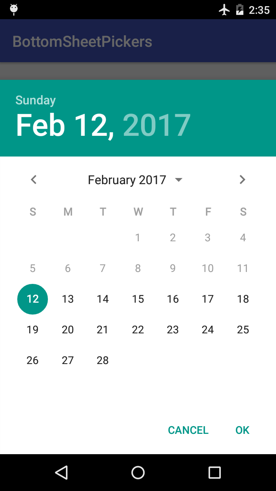
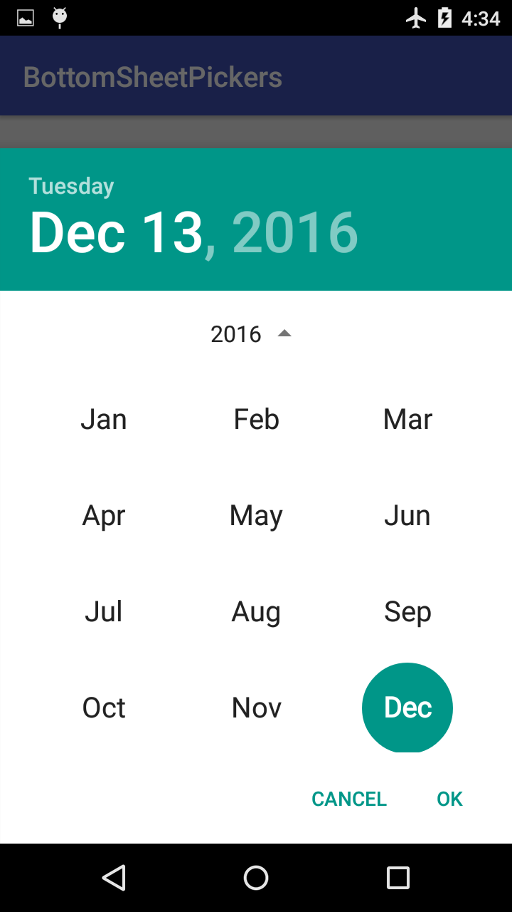
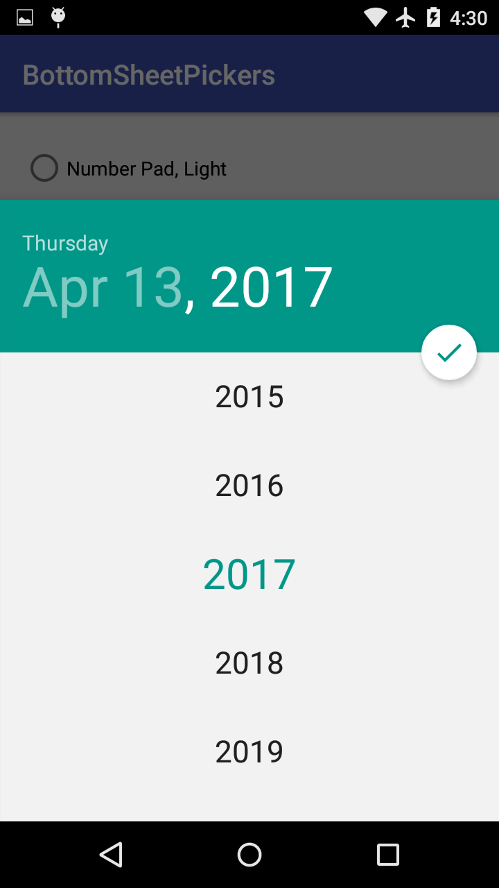

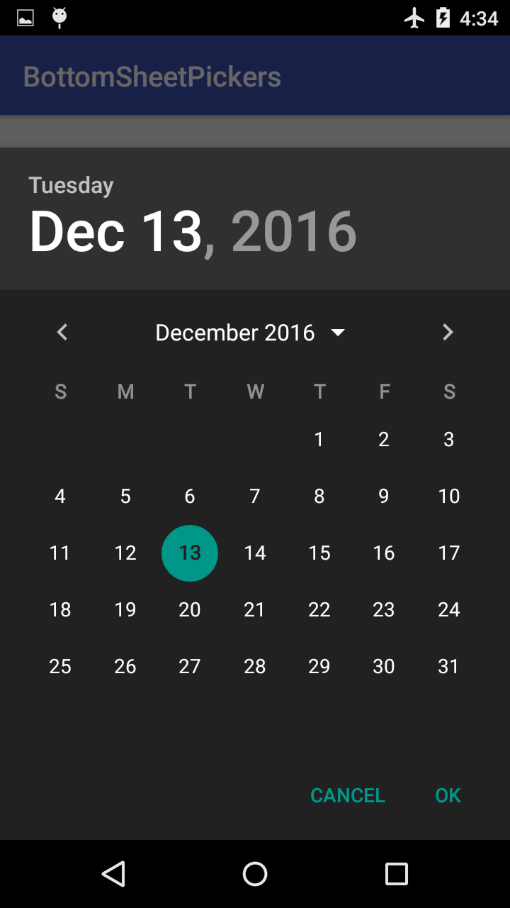
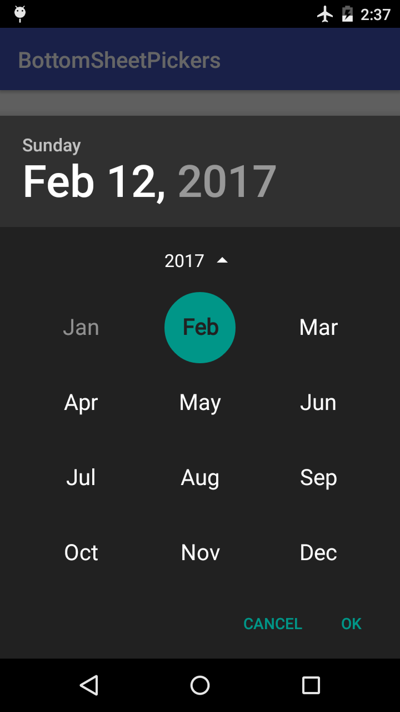
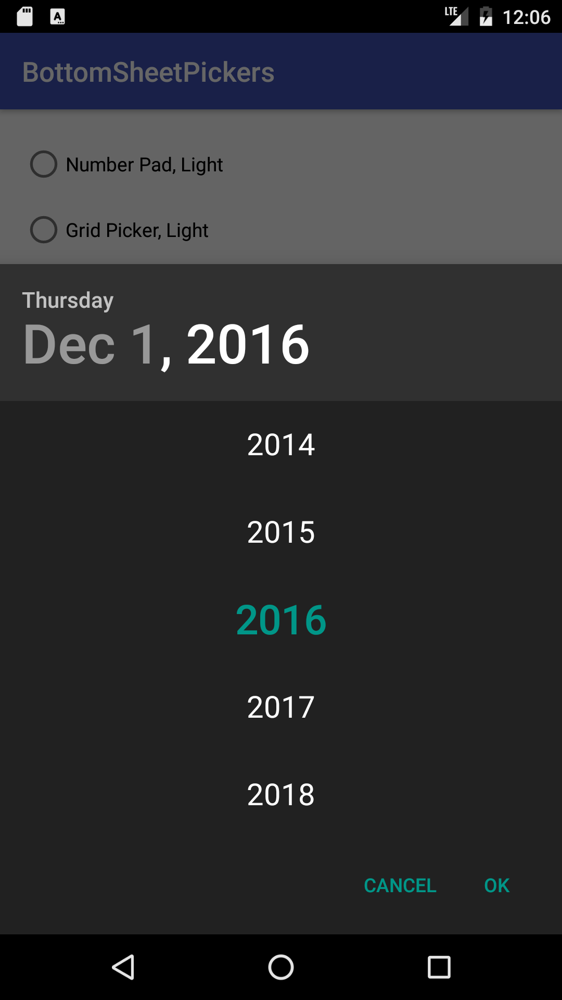

## Time Pickers

### Number Pad

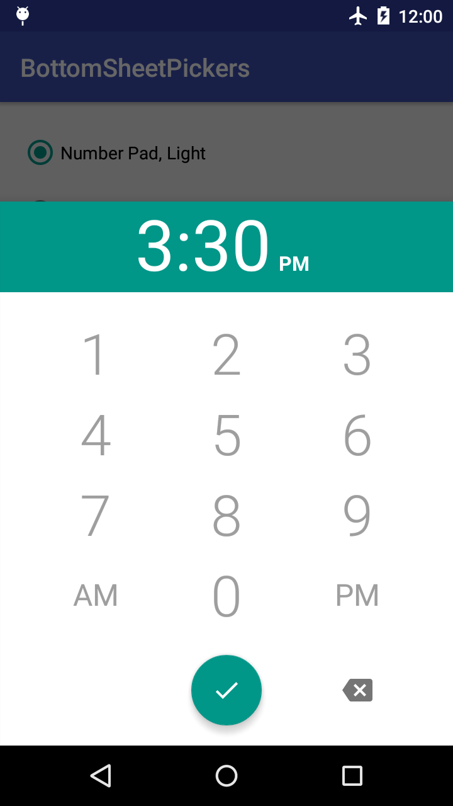
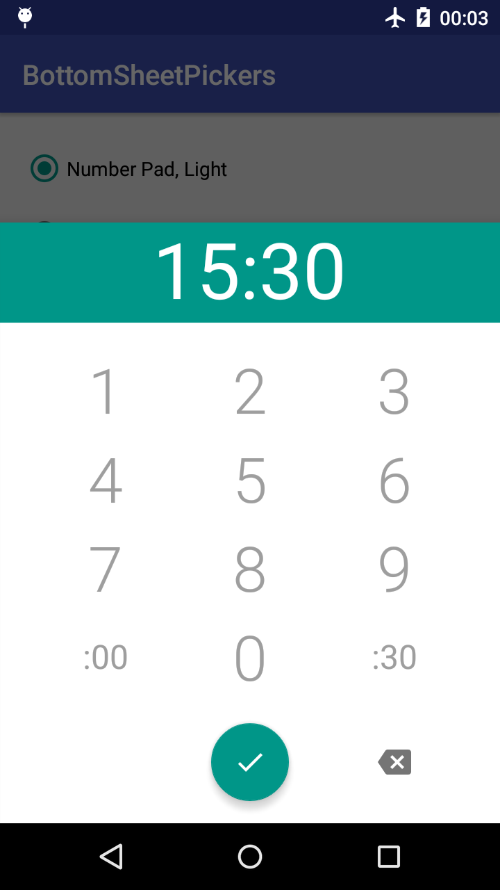
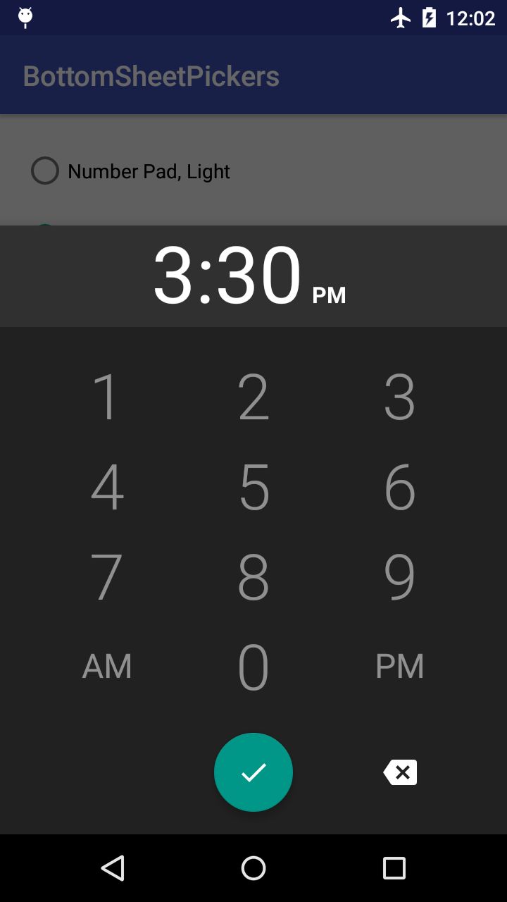


### Grid Picker

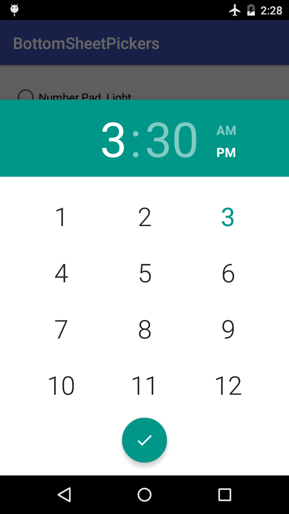
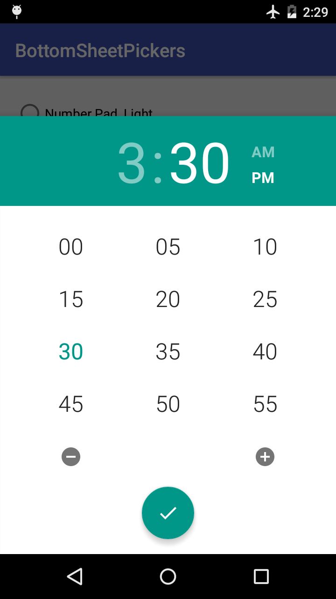
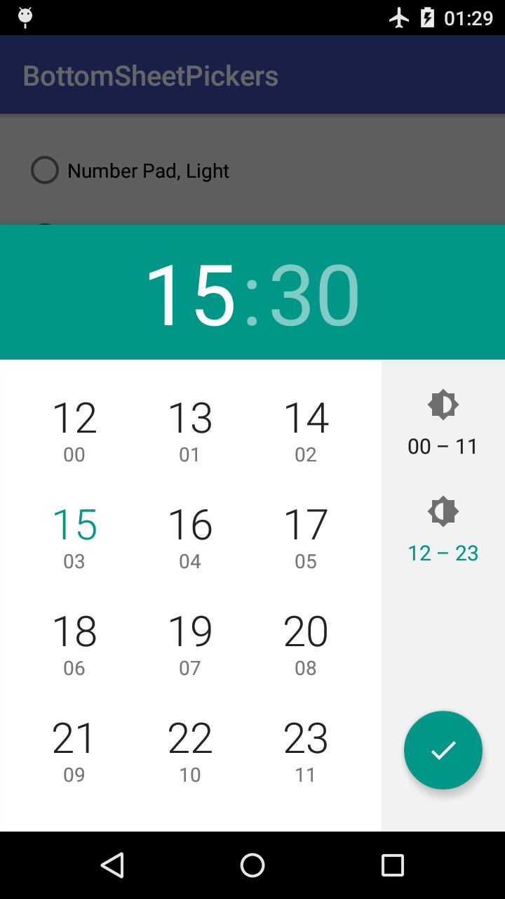

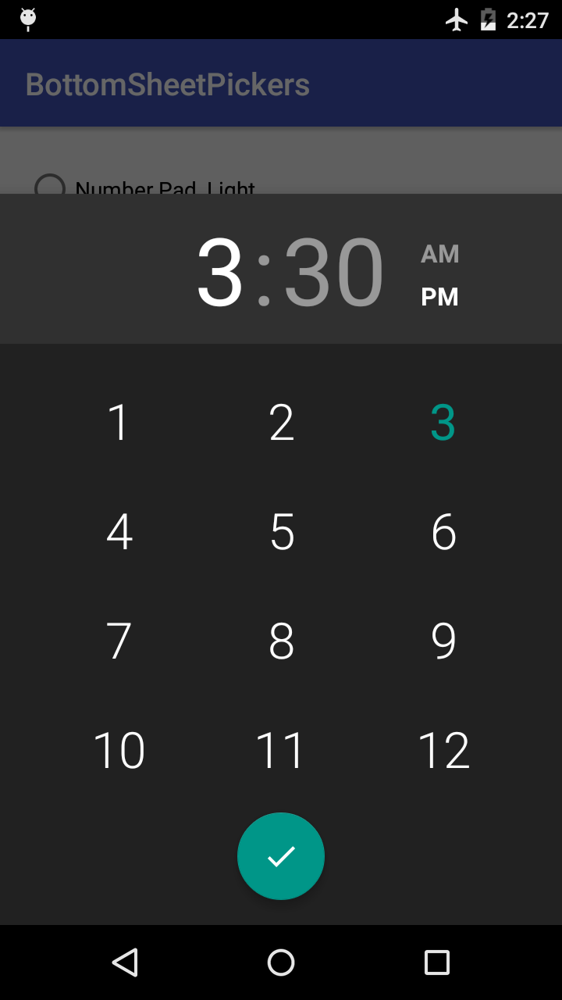
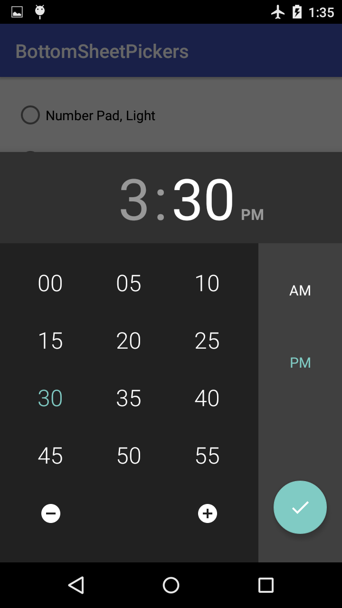
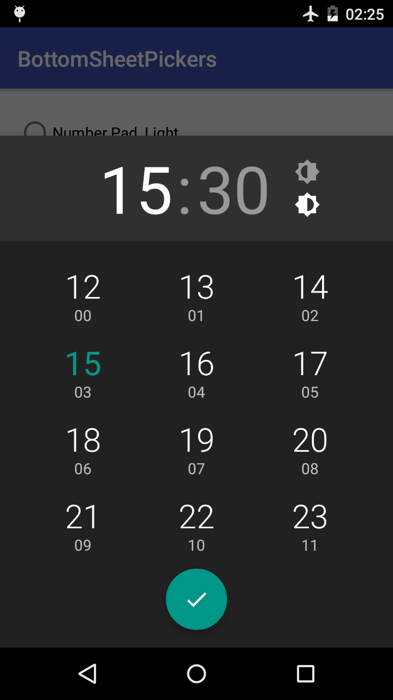

## Table of Contents
1. [Installation](#installation)
2. [Usage](#usage)
  1. [Implement Callbacks](#implement-callbacks)
  2. [Create Pickers](#create-pickers)
  3. [Show the Dialog](#show-the-dialog)
  4. [Theming](#theming)
  5. [Additional Options](#additional-options)
    1. [Basic Options](#basic-options)
    2. [DatePickerDialog and DatePickerDialog.Builder](#datepickerdialog-and-datepickerdialogbuilder)
    3. [NumberPadTimePickerDialog and NumberPadTimePickerDialog.Builder](#numberpadtimepickerdialog-and-numberpadtimepickerdialogbuilder)
    4. [GridTimePickerDialog and GridTimePickerDialog.Builder](#gridtimepickerdialog-and-gridtimepickerdialogbuilder)
    5. [Setters Only](#setters-only)
3. [Attribution](#attribution)
4. [License](#license)

## Installation
Add the following dependency to your module's `build.gradle`:
```groovy
dependencies {
  compile 'com.philliphsu:bottomsheetpickers:2.3.0'
}
```

If you are using any of the `appcompat-v7`, `design`, or `gridlayout-v7` support libraries,
you should exclude them from the library and keep those dependencies in your own `build.gradle`
file.

```groovy
compile('com.philliphsu:bottomsheetpickers:2.3.0') {
    exclude group: 'com.android.support', module: 'appcompat-v7'
    exclude group: 'com.android.support', module: 'design'
    exclude group: 'com.android.support', module: 'gridlayout-v7'
}
```

## Usage
You must be using a `android.support.v4.app.FragmentActivity` or `android.support.v4.app.Fragment`.
The pickers are indirect subclasses of `android.support.v4.app.DialogFragment`.

### Implement Callbacks

To retrieve the date or time set in the pickers, implement an appropriate callback interface.

* `com.philliphsu.bottomsheetpickers.date.DatePickerDialog.OnDateSetListener`
* `BottomSheetTimePickerDialog.OnTimeSetListener`

```java
@Override
public void onDateSet(DatePickerDialog dialog, int year, int monthOfYear, int dayOfMonth) {
    Calendar cal = new java.util.GregorianCalendar();
    cal.set(Calendar.YEAR, year);
    cal.set(Calendar.MONTH, monthOfYear);
    cal.set(Calendar.DAY_OF_MONTH, dayOfMonth);
    mText.setText("Date set: " + DateFormat.getDateFormat(this).format(cal.getTime()));
}

@Override
public void onTimeSet(ViewGroup viewGroup, int hourOfDay, int minute) {
    Calendar cal = new java.util.GregorianCalendar();
    cal.set(Calendar.HOUR_OF_DAY, hourOfDay);
    cal.set(Calendar.MINUTE, minute);
    mText.setText("Time set: " + DateFormat.getTimeFormat(this).format(cal.getTime()));
}
```

### Create Pickers

```java
Calendar now = Calendar.getInstance();
// As of version 2.3.0, `BottomSheetDatePickerDialog` is deprecated.
DatePickerDialog date = DatePickerDialog.newInstance(
    MainActivity.this,
    now.get(Calendar.YEAR),
    now.get(Calendar.MONTH),
    now.get(Calendar.DAY_OF_MONTH));

// Configured according to the system preference for 24-hour time.
NumberPadTimePickerDialog pad = NumberPadTimePickerDialog.newInstance(MainActivity.this);
// Alternatively, you can set 24-hour mode on your own.
boolean is24HourMode = ...
NumberPadTimePickerDialog pad = NumberPadTimePickerDialog.newInstance(MainActivity.this, is24HourMode);

GridTimePickerDialog grid = GridTimePickerDialog.newInstance(
    MainActivity.this,
    now.get(Calendar.HOUR_OF_DAY),
    now.get(Calendar.MINUTE),
    DateFormat.is24HourFormat(MainActivity.this));
```

As of version 2.3.0, you have the option to create pickers using the `Builder` pattern.
This is helpful if you want to chain together [additional options](#additional-options)
before creating the dialog. Of course, you can continue creating a dialog with
`newInstance()` as usual, and then just call setters on the dialog itself.

```java
DatePickerDialog date = new DatePickerDialog.Builder(
    MainActivity.this,
    now.get(Calendar.YEAR),
    now.get(Calendar.MONTH),
    now.get(Calendar.DAY_OF_MONTH))
    /* ... Set additional options ... */
    .build();

// Configured according to the system preference for 24-hour time.
NumberPadTimePickerDialog pad = new NumberPadTimePickerDialog.Builder(MainActivity.this)
    /* ... Set additional options ... */
    .build();
// Alternatively, you can set 24-hour mode on your own.
NumberPadTimePickerDialog pad = new NumberPadTimePickerDialog.Builder(MainActivity.this, is24HourMode)
    /* ... Set additional options ... */
    .build();

GridTimePickerDialog grid = new GridTimePickerDialog.Builder(
    MainActivity.this,
    now.get(Calendar.HOUR_OF_DAY),
    now.get(Calendar.MINUTE),
    DateFormat.is24HourFormat(MainActivity.this))
    /* ... Set additional options ... */
    .build();
```

### Show the Dialog

Pass in a `android.support.v4.app.FragmentManager` to the dialog's `show()`.

```java
// For a `android.support.v4.app.FragmentActivity`:
dialog.show(getSupportFragmentManager(), TAG);

// For a `android.support.v4.app.Fragment`:
dialog.show(getFragmentManager(), TAG);
```

### Theming
The pickers automatically use your current theme's `colorAccent` defined in your `styles.xml`.

You can specify whether to use a light (default) or dark theme:
* in `styles.xml` by specifying a boolean value for the attribute `themeDark` in your theme.
```xml
<item name="themeDark">true</item>
```
* in code with the dialog's `setThemeDark(boolean dark)` method. This overwrites the value specified in XML.

### Additional Options
These additional APIs can be used to customize the appearance of the picker. They are
available both as setter methods and as `Builder` options, unless otherwise noted.

#### Basic Options
These APIs are available in all pickers.

* `setThemeDark(boolean dark)`
Set a dark or light theme.

* `setAccentColor(@ColorInt int color)`
Set the accent color. This color is primarily used to tint views in the picker.
If this picker is using the light theme and you did not call `setHeaderColor(int)`,
this color will also be applied to the dialog's header.

* `setBackgroundColor(@ColorInt int color)`
Set the background color. If this color is dark, consider setting the theme dark to ensure text
in the picker has enough contrast.

* `setHeaderColor(@ColorInt int color)`
Set the header color. If this color is light, consider setting the header text dark to ensure
it has enough contrast.

* `setHeaderTextDark(boolean dark)`
Set the header text to use a light or dark color. The default is false, so a light color is applied.

#### `DatePickerDialog` and `DatePickerDialog.Builder`

* `setFirstDayOfWeek(int startOfWeek)`
Use this to set the day (`Calendar.SUNDAY` through `Calendar.SATURDAY`) that a week should start on.

* `setYearRange(int startYear, int endYear)`
Sets the range of years to be displayed by this date picker. If a minimal date and/or maximal date
were set using `setMinDate(Calendar)` or `setMaxDate(Calendar)`, dates in the specified range of
years that lie outside of the minimal and maximal dates will be disallowed from being selected.
_This does NOT change the minimal date's year or the maximal date's year._

* `setMinDate(Calendar calendar)`
Sets the minimal date that can be selected in this date picker. Dates before (but not including)
the specified date will be disallowed from being selected.

* `setMaxDate(Calendar calendar)`
Sets the maximal date that can be selected in this date picker. Dates after (but not including)
the specified date will be disallowed from being selected.

* `setHeaderTextColorSelected(@ColorInt int color)`
Set the color of the header text when it is selected.

* `setHeaderTextColorUnselected(@ColorInt int color)`
Set the color of the header text when it is not selected.

* `setDayOfWeekHeaderTextColorSelected(@ColorInt int color)`
Set the color of the day-of-week header text when it is selected.

* `setDayOfWeekHeaderTextColorUnselected(@ColorInt int color)`
Set the color of the day-of-week header text when it is not selected.

#### `NumberPadTimePickerDialog` and `NumberPadTimePickerDialog.Builder`

* `setHeaderTextColor(@ColorInt int color)`
Set the color of the header text that stores the inputted time.

#### `GridTimePickerDialog` and `GridTimePickerDialog.Builder`

* `setHeaderTextColorSelected(@ColorInt int color)`
Set the color of the header text when it is selected.

* `setHeaderTextColorUnselected(@ColorInt int color)`
Set the color of the header text when it is not selected.

* `setTimeSeparatorColor(@ColorInt int color)`
Set the color of the time separator that separates the hour and minute views in the header.

* `setAmPmTextColorSelected(@ColorInt int color)`
Set the color of the AM/PM text when it is selected. This is equivalent to
`setHalfDayButtonColorSelected(int)` in 24-hour time.

* `setAmPmTextColorUnselected(@ColorInt int color)`
Set the color of the AM/PM text when it is not selected. This is equivalent to
`setHalfDayButtonColorUnselected(int)` in 24-hour time.

* `setHalfDayButtonColorSelected(@ColorInt int color)`
Set the color of the half-day image button when it is selected. This is equivalent to
`setAmPmTextColorSelected(int)` in 12-hour time.

* `setHalfDayButtonColorUnselected(@ColorInt int color)`
Set the color of the half-day image button when it is not selected. This is equivalent to
`setAmPmTextColorUnselected(int)` in 12-hour time.

#### Setters Only
These are only available as setter methods in `NumberPadTimePickerDialog`.

* `setHint(String hint)` or `setHint(@StringRes int resid)`
Sets the hint of the input time TextView.

* `setInputTextSize(int textSize)`
Sets the text size in px of the input time TextView.

* `getInputTextView()`
Returns the `TextView` that stores the inputted time.

## Attribution

This library is based on code from the following AOSP repositories:
* https://android.googlesource.com/platform/frameworks/opt/datetimepicker
* https://android.googlesource.com/platform/packages/apps/Calculator

## License
```
Copyright 2017 Phillip Hsu

Licensed under the Apache License, Version 2.0 (the "License");
you may not use this file except in compliance with the License.
You may obtain a copy of the License at

   http://www.apache.org/licenses/LICENSE-2.0

Unless required by applicable law or agreed to in writing, software
distributed under the License is distributed on an "AS IS" BASIS,
WITHOUT WARRANTIES OR CONDITIONS OF ANY KIND, either express or implied.
See the License for the specific language governing permissions and
limitations under the License.
```