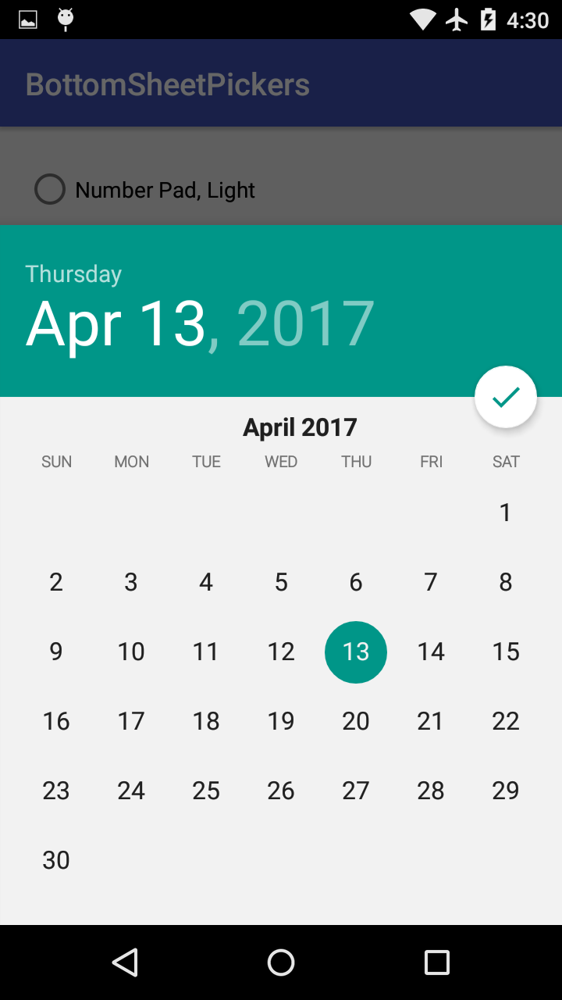
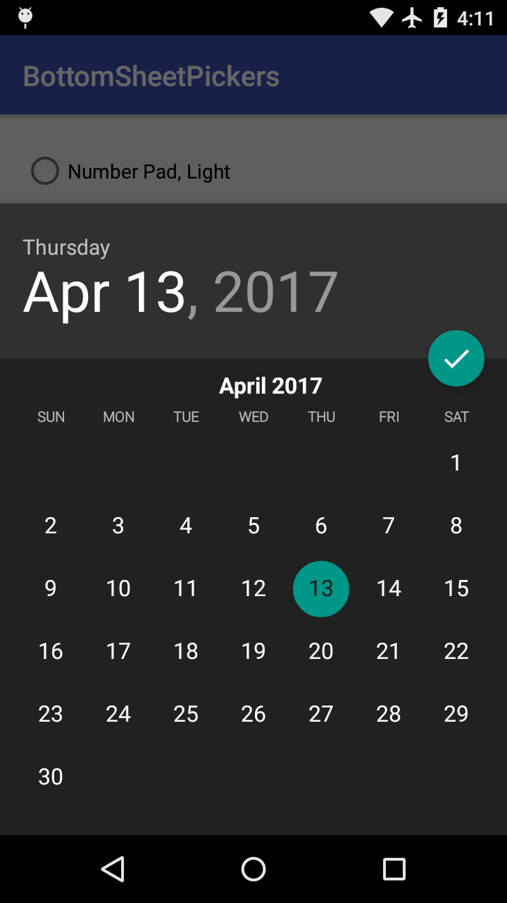

# BottomSheetPickers
[  ]
(https://bintray.com/philliphsu/maven/bottom-sheet-pickers/_latestVersion)

BottomSheetPickers is a library of new date and time pickers for Android,
supporting API level 14 and up.

## Date Picker






## Time Pickers

### Number Pad


### Grid Picker


## Installation
Add the following dependency to your module's `build.gradle`:
```groovy
dependencies {
  compile 'com.philliphsu:bottomsheetpickers:2.0.2'
}
```

## Usage
You must be using a `android.support.v4.app.FragmentActivity` or `android.support.v4.app.Fragment`.
The pickers are indirect subclasses of `android.support.v4.app.DialogFragment`.

### Implement callbacks

To retrieve the date or time set in the pickers, implement an appropriate callback interface.

* `com.philliphsu.bottomsheetpickers.date.DatePickerDialog.OnDateSetListener`
* `BottomSheetTimePickerDialog.OnTimeSetListener`

```java
@Override
public void onDateSet(DatePickerDialog dialog, int year, int monthOfYear, int dayOfMonth) {
    Calendar cal = new java.util.GregorianCalendar();
    cal.set(Calendar.YEAR, year);
    cal.set(Calendar.MONTH, monthOfYear);
    cal.set(Calendar.DAY_OF_MONTH, dayOfMonth);
    mText.setText("Date set: " + DateFormat.getDateFormat(this).format(cal.getTime()));
}

@Override
public void onTimeSet(ViewGroup viewGroup, int hourOfDay, int minute) {
    Calendar cal = new java.util.GregorianCalendar();
    cal.set(Calendar.HOUR_OF_DAY, hourOfDay);
    cal.set(Calendar.MINUTE, minute);
    mText.setText("Time set: " + DateFormat.getTimeFormat(this).format(cal.getTime()));
}
```

### Create your desired picker

```java
Calendar now = Calendar.getInstance();
BottomSheetDatePickerDialog date = BottomSheetDatePickerDialog.newInstance(
    MainActivity.this,
    now.get(Calendar.YEAR),
    now.get(Calendar.MONTH),
    now.get(Calendar.DAY_OF_MONTH));

NumberPadTimePickerDialog pad = NumberPadTimePickerDialog.newInstance(MainActivity.this);

GridTimePickerDialog grid = GridTimePickerDialog.newInstance(
    MainActivity.this,
    now.get(Calendar.HOUR_OF_DAY),
    now.get(Calendar.MINUTE),
    DateFormat.is24HourFormat(MainActivity.this));
```

### Show the dialog

Pass in a `android.support.v4.app.FragmentManager` to the dialog's `show()`.

```java
// For a `android.support.v4.app.FragmentActivity`:
dialog.show(getSupportFragmentManager(), TAG);

// For a `android.support.v4.app.Fragment`:
dialog.show(getFragmentManager(), TAG);
```

> **NOTE:** Currently, `BottomSheetDatePickerDialog` cannot be dismissed by swiping the sheet down.
This is to allow vertical swiping to scroll the date picker. Touching outside of the sheet also
does not dismiss it. It is dismissed normally when you confirm your date selection.

### Theming
The pickers automatically use your current theme's `colorAccent` defined in your `styles.xml`.

You can specify whether to use a light (default) or dark theme:
* in code with the dialog's `setThemeDark(boolean dark)` method. **Call this before `show()`ing the dialog.**
* in `styles.xml` by specifying a boolean value for the attribute `themeDark` in your theme.

```xml
<item name="themeDark">true</item>
```

> **NOTE:** `setThemeDark(boolean dark)` overwrites the value specified in XML.

### Additional Options
`NumberPadTimePickerDialog` exposes the following additional APIs:
* `setHint(String hint)` or `setHint(@StringRes int resid)`: Sets the hint of the input time TextView.
* `setInputTextSize(int textSize)`: Sets the text size in px of the input time TextView.
* `getInputTextView()`: Returns the `TextView` that stores the inputted time.

## Attribution

This library is based on code from the following AOSP repositories:
* https://android.googlesource.com/platform/frameworks/opt/datetimepicker
* https://android.googlesource.com/platform/packages/apps/Calculator

## License
```
Copyright 2016 Phillip Hsu

Licensed under the Apache License, Version 2.0 (the "License");
you may not use this file except in compliance with the License.
You may obtain a copy of the License at

   http://www.apache.org/licenses/LICENSE-2.0

Unless required by applicable law or agreed to in writing, software
distributed under the License is distributed on an "AS IS" BASIS,
WITHOUT WARRANTIES OR CONDITIONS OF ANY KIND, either express or implied.
See the License for the specific language governing permissions and
limitations under the License.
```